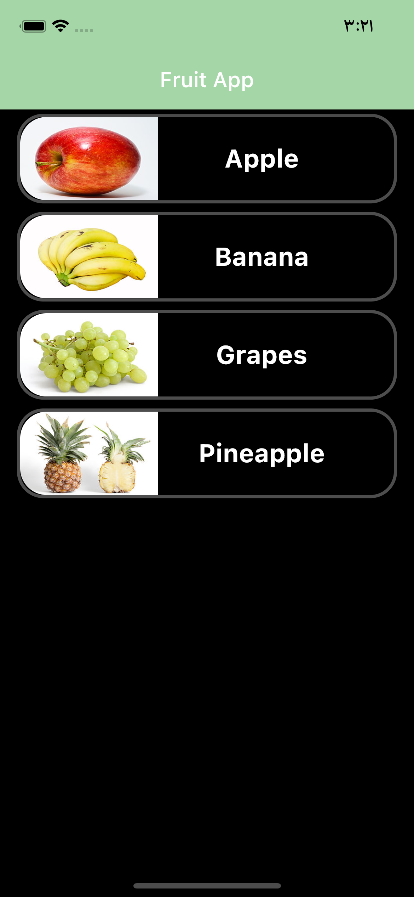
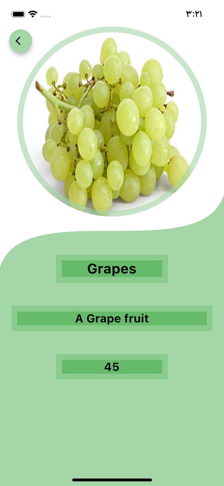
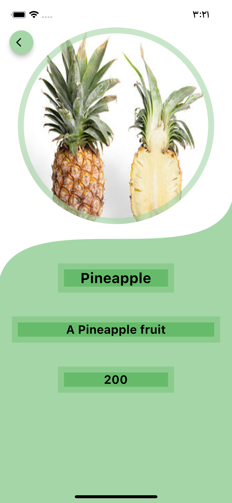

# fruit_project

A new fruit app using Flutter.

I divided the project into folders  
/lib/ 
    - data: includes all files the data as backend 
    - models: we have a one modle Item class 
    - screens: we have two screens [home, item details] 
        - Home Screen to present the table of items 
        - Item Details Screen  
    - services: I used with one services, HttpServices 
    - utils: to manipulation the data, convert from json to obj, response to json and more... 
    - widgets: templates of widgets, I can reused them 
    - theme: here I can select the style of app  
        - colors file: all colors of app 
        - style file : constants 
    - main.dart:  

